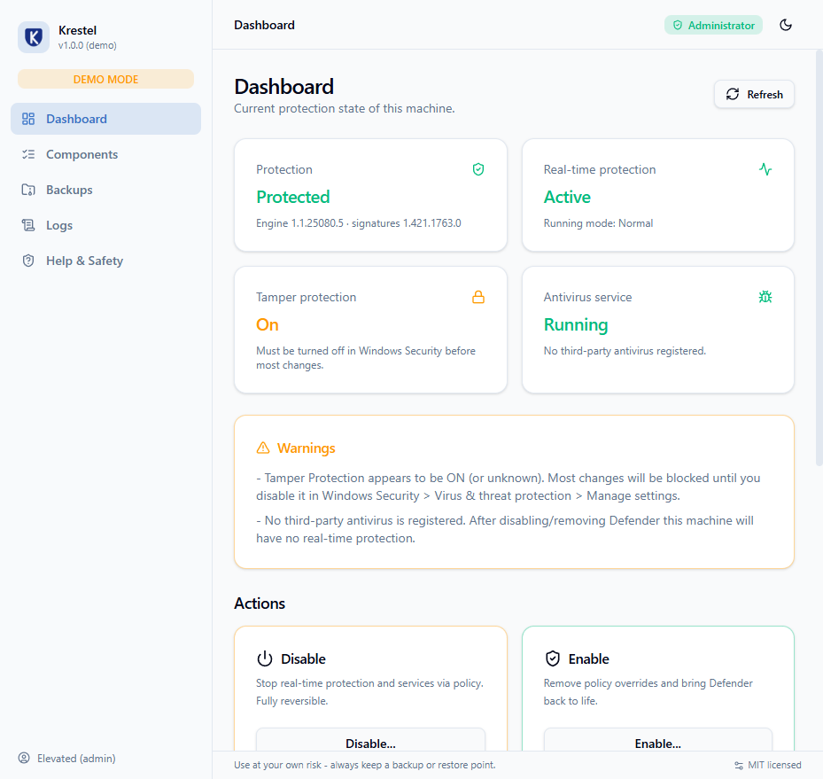

# Krestel


A modern desktop application to **inspect, disable, enable, remove and restore Windows Defender** — built with Electron, React and [shadcn/ui](https://ui.shadcn.com), powered by a transparent PowerShell engine, packaged with Inno Setup.



> [!CAUTION]
> Disabling or removing an antivirus is a security decision. Use at your own risk, keep backups enabled, and install another antivirus if you remove Defender. The app is designed to make the *safe* path the easy path, but the responsibility stays with you.

## Why this exists

Community tools like [windows-defender-remover](https://github.com/ionuttbara/windows-defender-remover) get the job done with batch scripts, but they are all-or-nothing: no preview of what will run, no backup, no restore, and no visibility while they run. Krestel is a from-scratch take on the same task with a proper safety model:

| | Batch-script tools | Krestel |
|---|---|---|
| Plan preview | ❌ | ✅ every step listed before execution |
| Dry run | ❌ | ✅ run any action without changing the system |
| Backups | ❌ | ✅ registry + services + tasks exported automatically |
| Restore | ❌ | ✅ one-click restore from any backup, incl. appx re-registration |
| Component selection | ❌ | ✅ per-component toggles with risk labels |
| Tamper Protection check | ❌ | ✅ detected and surfaced before you start |
| Third-party AV check | ❌ | ✅ warns when you would be left unprotected |
| Live execution log | ❌ | ✅ per-step progress, live PowerShell output, exportable |
| Confirmation | one Enter | typed `REMOVE` confirmation for destructive actions |
| Restore point | "recommended" | ✅ optional automatic `Checkpoint-Computer` |
| System repair | ❌ | ✅ optional `sfc /scannow` + `DISM RestoreHealth` during restore |

## Supported platforms

- **Windows 10** (all feature updates, build 10240+) and **Windows 11** — x64, x86 and ARM64.
- The status probe detects the exact build and adapts (e.g. the Windows Security app package only exists on 1809+; ATP components only in enterprise environments).
- Windows 7/8.1 use a different (MSE-era) Defender stack and are reported as unsupported.
- Electron itself requires Windows 10+; there are no plans to support older kernels.

## Getting started

```bash
npm install
npm run dev        # launch the desktop app with hot reload
```

The app starts unelevated by design. Click **Restart as administrator** in the top bar (UAC prompt) — all actions require elevation; status inspection works without it.

### Build the installer (Inno Setup)

One command builds everything — app bundles, the packed `win-unpacked` directory with the Krestel icon, and the final Inno Setup installer:

```bash
npm run installer       # -> dist/installer/Krestel-Setup-<version>.exe
```

Requirements: [Inno Setup 6](https://jrsoftware.org/isdl.php) (`winget install JRSoftware.InnoSetup`). The script lives in [`installer/krestel.iss`](installer/krestel.iss) — start-menu/desktop icons, per-user or admin install, clean uninstaller included.

To verify the full installer lifecycle automatically (silent install → file/registry checks → app launch → silent uninstall):

```bash
npm run installer:test
```

### Browser preview (demo mode)

The renderer detects when it is not running inside Electron and switches to demo data, so you can develop the UI in a plain browser:

```bash
npm run build
npm run preview:web      # http://localhost:4173
```

## Using the app

1. **Read the dashboard.** It shows protection state, real-time protection, Tamper Protection, service health, registered third-party AV and system details.
2. **Turn off Tamper Protection first** if it is on: *Windows Security → Virus & threat protection → Manage settings → Tamper Protection → Off*. While it is on, Windows blocks changes and steps will fail with *access denied* (the log tells you).
3. **Prefer Disable over Remove.** Disable is policy-based and instantly reversible via Enable.
4. **If you Remove:** keep *Back up before removal* on (Components → Safety options). A full backup (registry `.reg` exports, service/driver manifests, scheduled task XML) is written to `Documents\Krestel\backups\` and can be restored from the Backups page.
5. **Reboot** when the app tells you to.

### What each action does

- **Disable** — policy overrides (`DisableAntiSpyware`, `DisableAntiVirus`, real-time protection subkeys), optional Spynet/MAPS telemetry opt-out and SmartScreen off, then stops & disables `WinDefend`, `WdNisSvc` and (optionally) `SecurityHealthService` + tray autostart.
- **Enable** — removes the policy tree, resets service start types, restores the `SecurityHealth` Run entry and starts the services.
- **Remove** — (per-component, destructive): scheduled tasks, services (`WinDefend`, `WdNisSvc`, …), kernel drivers (`WdFilter`, `WdBoot`, `WdNisDrv`), Defender registry configuration, `Program Files\Windows Defender`, `ProgramData\Microsoft\Windows Defender`, the SecHealthUI appx package and (optionally) ATP components. File deletion uses locale-independent ownership/ACL takeover via the `SeTakeOwnershipPrivilege` (no `takeown.exe /d` prompt).
- **Restore** — re-imports the registry backup, re-registers scheduled tasks, recreates missing services from the manifest, resets startup types, re-registers the Windows Security app and optionally runs `sfc` + `DISM` to repair deleted binaries.

## Architecture

```
krestel/
├─ resources/scripts/status.ps1    # read-only system probe → JSON
├─ src/
│  ├─ main/                        # Electron main process
│  │  ├─ index.ts                  # window + IPC surface
│  │  └─ lib/
│  │     ├─ plans.ts               # step definitions per action mode
│  │     ├─ runner.ts              # generates + executes PowerShell, streams events
│  │     ├─ status.ts / backups.ts / settings.ts / admin.ts / ps.ts
│  ├─ preload/index.ts             # contextBridge API
│  └─ renderer/                    # React + shadcn/ui frontend
│     └─ src/{pages,components,state,lib}
├─ test/dryrun.cjs                 # harness: dry-run every plan outside Electron
├─ installer/krestel.iss           # Inno Setup script (npm run installer)
├─ scripts/
│  ├─ build-installer.cjs          # one-command builder: build -> pack -> ISCC
│  ├─ test-install.cjs             # automated install/launch/uninstall test
│  └─ make-icon.mjs                # regenerates build/icon.ico (shield + K)
└─ electron.vite.config.ts
```

- The **plan engine** builds an ordered step list per mode; the exact list you see in the preview is the exact list that executes (plan generation and execution share one source of truth).
- The **runner** writes a generated `.ps1` (UTF-8 BOM, per-step `try/catch`, `##STEP/##DONE/##FAIL` markers) and streams parsed events to the UI with per-step timeouts and cancellation.
- The **renderer** never touches the system: all privileged work happens in the main process behind a typed IPC bridge (`contextIsolation` + `sandbox` enabled, no `nodeIntegration`).

### Verifying changes yourself

```bash
npm run build:check        # typecheck (main + renderer) + production build
node test/dryrun.cjs remove && powershell -File out-test/dryrun-remove.ps1
```

The dry-run harness executes the real generated script with `DRYRUN=1` — nothing is changed, but PowerShell still compiles every step body, so it doubles as a syntax check.

## FAQ

**Some steps failed with "access denied".** Tamper Protection is on. Turn it off in Windows Security and re-run the action — steps are idempotent.

**Windows Update brought Defender back.** Cumulative updates can restore platform files and the Security app. Re-run the action, or keep Defender disabled by policy (updates cannot revert policy keys under `HKLM\SOFTWARE\Policies`).

**I removed files without a backup.** Run Restore with *repair system files* enabled (`sfc /scannow` + `DISM /RestoreHealth`). If that is insufficient, an in-place upgrade (running `setup.exe` and keeping files/apps) fully reinstalls Defender.

**Antivirus flags the app.** Tools that modify Defender are frequently false-positived. Build from source — everything the app does is visible in `src/main/lib/plans.ts`.

## Disclaimer

This project is not affiliated with Microsoft. Windows, Windows Defender and Windows Security are trademarks of Microsoft Corporation. Removing security software reduces your protection — the authors are not responsible for any damage or data loss.

## License

[MIT](LICENSE)
